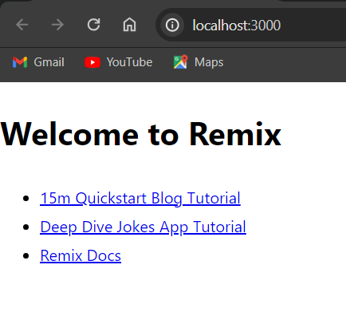

## Praktikum: Membuat Project Pertama ReactJS

1. Buat Folder Baru & Project Baru

**Soal 1**
- TypeScript : Superset dari JS untuk memper,udah pengemabangan project yang lebih besar dan kompleks.
- ESLint : Utilitas linting JavaScript yang membantu mengidentifikasi dan memperbaiki masalah dalam kode JavaScript .
- Tailwind CSS : Framework CSS.
- App Router : Package yang memungkinkan untuk menambahkan fitur router ke aplikasi web.
- Import alias : Cara untuk membuat alias untuk modul atau direktori dalam kode.

**Soal 2**
- .git : Untuk mengelola repositori.
- node_modules : Direktori Node.js yang menyimpan semua package atau dependensi yang digunakan dalam project.
- public : Untuk menyimpan aset yang tidak berubah atau jarang berubah.
- src : Untuk menyimpan kode sumber atau kode JavaScript yang berkaitan langsung dengan aplikasi web yang sedang dibangun.
- .eslintrc.json : Digunakan untuk mengkonfigurasi ESLint.
- .gitignore : Digunakan untuk mengabaikan file atau direktori tertentu dalam proses pengecekan perubahan pada Git.
- next.config.mjs : Untuk konfigurasi pengaturan project.
- next-env.d.ts : Bagian dari setup awal yang dilakukan untuk mendukung pengembangan TypeScript.
- package.json : Digunakan oleh Node.js dan npm untuk mengelola proyek JavaScript atau TypeScript.
- package-lock.json : Untuk menentukan versi spesifik dari setiap paket yang diinstal, serta dependensi mana yang harus diinstal bersama dengan paket tertentu.
- postcss.config.js : Untuk mengkonfigurasi PostCSS
- README.md : Digunakan untuk memberikan informasi tentang proyek atau direktori tertentu.
- tailwind.config.ts : Untuk konfigurasi untuk Tailwind CSS.
- tsconfig.json : Untuk konfigurasi TypeScript dan lain lain.

2. Run Program

**Soal 3**

- Tidak diperlukan me-reload halaman browser dan tidak perlu menjalankan perintah npm run dev dikarenakan pada Next.js terdapat fitur Fast Refresh memberi umpan balik instan pada pengeditan yang dilakukan pada komponen React

## Tugas
**Tampilan Awal - Framework Remix**

**Tampilan Awal - Framework Gatsby**

**Perbedaan**
- Next.js : Memiliki Fleksibilitas yang tinggi dan banyak pilihan fitur.
- Remix : Terlihat lebih simple dan ringan.
- Gatsby : Terlihat lebih kompleks pada proses pembuatan projectnya dibandingkan next.js dan remix.