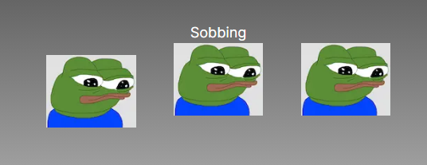
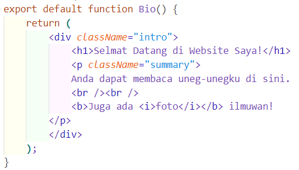
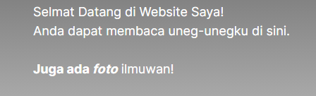
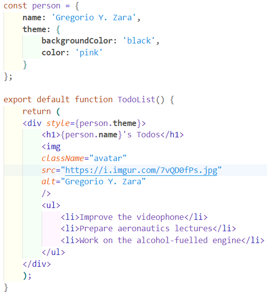
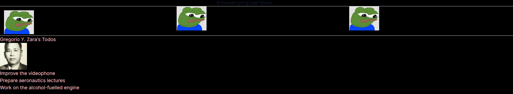
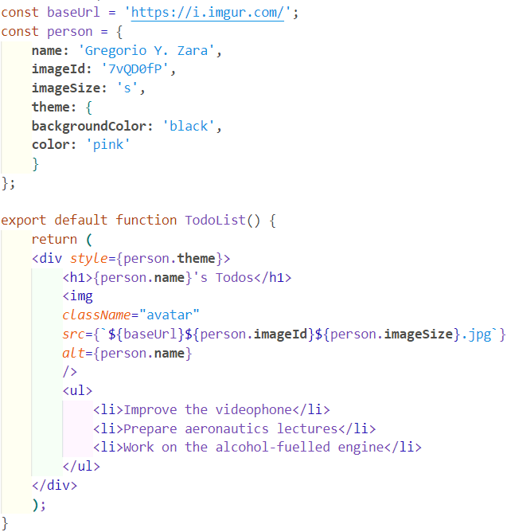
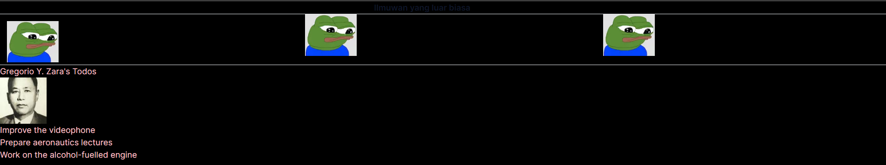

# Pertemuan 03 : Components, JSX, dan Props

1. **Praktikum 1 - Soal 1**

    

    Pada Praktikum 1 ini mempelajari bagaimana mendefinisikan komponen dari membuat komponen dan import komponen.

    Terdapat error dimana harus melakukan edit pada next.config.mjs untuk mengakses gambar dari URL.

    Berikut merupakan solve error nya:

    

2. **Praktikum 2 - Soal 2**

    Pada praktikum ke 2 ini mempelajari membuat named export named import pada komponen, dan juga komponen dapat digunakan pada komponen lainnya

    Berikut adalah hasil dari praktikum 2, hasilnya tidak terlalu berbeda dengan praktikum sebelumnya

    

3. **Soal 3**

    Error terjadi dikarenakan aturan jsx hanya dapat mengembalikan satu parent, jadi harus di bungkus dengan satu parent seperti tag <.div> atau tag kosong <>

    Berikut merupakan hasil perbaikan kode :

    

    Berikut tampilannya

    

4. **Praktikum 3 - Soal 4**

    Kode yang telah diperbaiki

    

    Berikut adalah Hasil nya

    

5. **Praktikum 3 - Soal 5**

    Ya ada perbedaan, Berikut tampilannya

    

6. **Praktikum 3 - Soal 6**

    Kode yang telah diperbaiki

    

    Pada kode diatas untuk menggunakan baseUrl pada src, diharuskan menggunakan backtick(`) dan ${} dengan cara tersebut untuk pergantian imageId lebih fleksibel daripada harus mengganti baseUrlnya

    Berikut tampilannya

    
    

7. 
