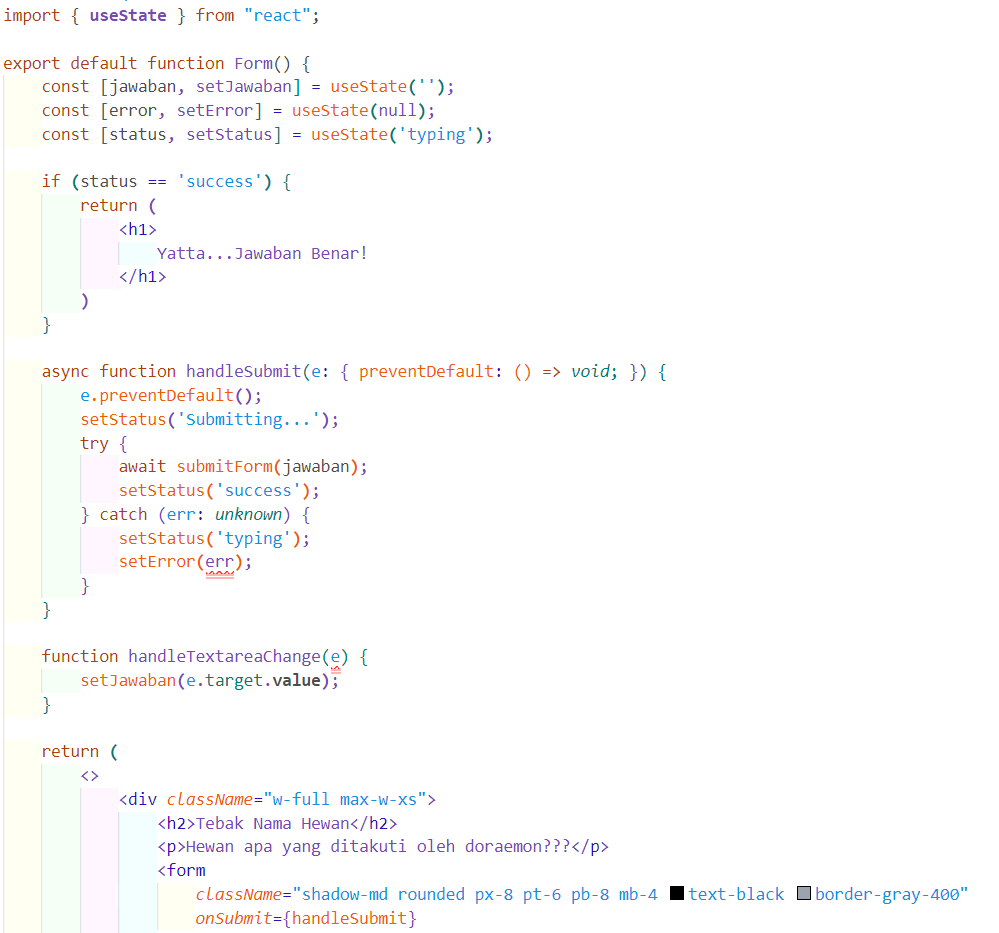

# Pertemuan 04 : Event dan State

1. **Praktikum 1 - Langkah 1**

    Kode :

    

    Hasil :

    

2. **Praktikum 1 - Langkah 2**

    Kode :

    

    Hasil :

    
    
3. **Praktikum 2**

    Kode :

    

    Hasil : 

    

    Penjelasan :

    Pada function *Tombol_2* memiliki parameter *isiPesan* dan *namaTombol* dengan kedua parameter tersebut membuat *Tombol_2* menjadi dinamis, sehingga pada saat *Tombol_2* dipanggil di *page.tsx* parameter *isiPesan* dan *namaTombol* dapat di isi.

4. **Praktikum 3 - Langkah 1**

    Kode : 

    

    Hasil : (Alert muncul 2 kali)

    
    

5. **Praktikum 3 - Langkah 2**

    Kode :

    

    Hasil : (Dikarenakan ditambah kode untuk stop propagation, maka alert hanya muncul 1 kali)

    

6. **Praktikum 4 - Langkah 1**

    Kode :

    

    Hasil : 

    

7. **Praktikum 4 - Langkah 2**

    Kode : 

    

    Hasil :

    

8. **Praktikum 5 - Langkah 1**

    Kode :

    
    

    Hasil :

    Jawaban Benar

    
    

    Jawaban Salah

    

9. **Praktikum 5 - Langkah 2**

    Kode : 

    

    Hasil :

    

10. **Praktikum 6 - Langkah 1**

    Kode :

    

    Hasil :

    
    

11. **Praktikum 6 - Langkah 2**

    Kode :

    
    

    Hasil :

    

    **Soal** :

    1. Memberi key berupa email membuat penerima pada text area berubah, apabila tidak diberi key tersebut maka penerima pada test area akan tetap sama dikarenakan inputny amasih tersimpan

    2. Fungsinya adalah agar saat user melakukan suatu aksi seperti input penerima data inputannya akan berubah ketika berganti kontak lain, sebaliknya apabila tidak diberi props key tersebut maka inputan user akan tersimpan walaupun sudah berganti kontak ke yang lain