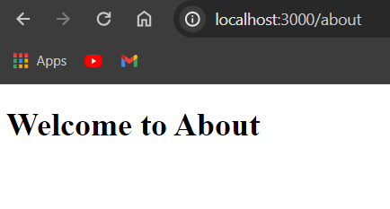

# Pertemuan 05 : Routing

1. **Praktikum 1**

    Home :

    

    About :

    

    Profile (ToDo) : 

    

2. **Praktikum 2**

    Blog :

    

    First Blog :

    
    
    Second Blog (ToDo) :

    

    Pertanyaan : Apa kekurangan yang mungkin terjadi jika menggunakan pendekatan pada Praktikum 2 untuk menangani routing?

    Jawab : Perpindahan antar halaman masih manual, url masih statis dan belum dinamis.