# Pertemuan 07 : Context

## **Praktikum 1: Membuat Variasi Ukuran Teks Heading dengan Context**

### **Langkah 1 : Buat project baru dan repo baru di GitHub**

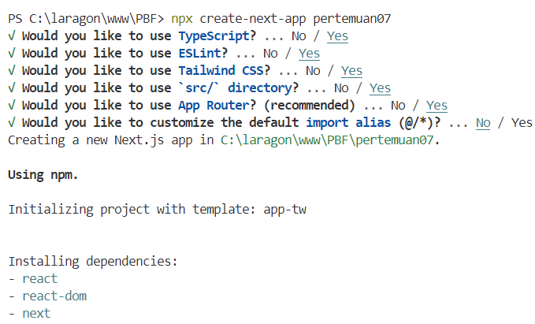

### **Langkah 2: Buat struktur folder dengan prinsip atomic design**

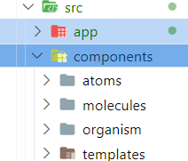

### **Langkah 3: Buat komponen atom baru**

**Heading :**

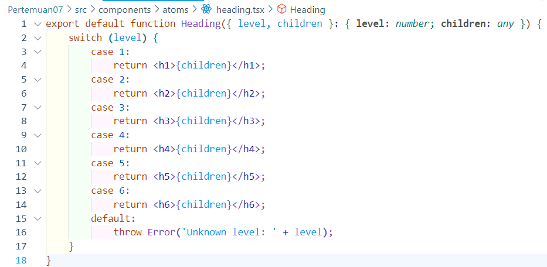

**Section :**

**Main Page :**

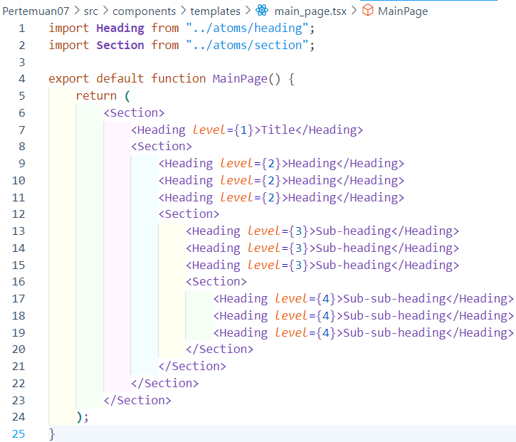

### **Langkah 4: Ubah isi kode page.tsx dan run**

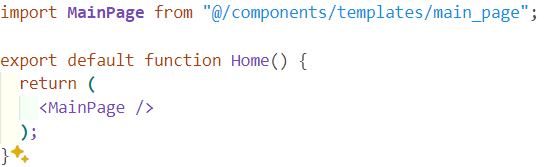

### **Soal 1**

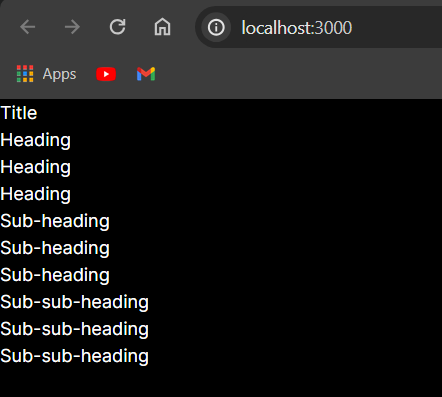

### **Langkah 5.1: Buat Context**

### **Langkah 5.2: Gunakan context**

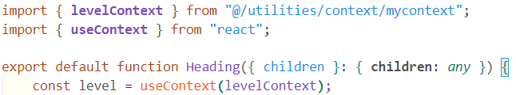

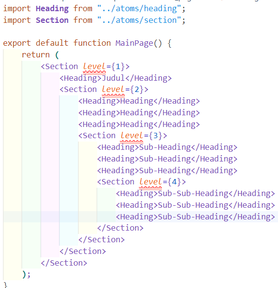

### **Langkah 5.3: Sediakan context**

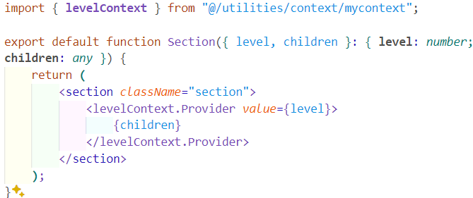

### **Soal 2**

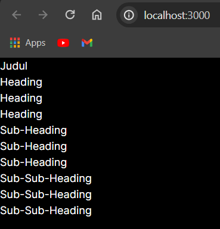

Terjadi error "Error: × You're importing a component that needs createContext. It only works in a Client Component but none of its parents are marked with "use client", so they're Server Components by default."

Cara untuk mengatasinya adalah memberi 'use client'; pada page.tsx

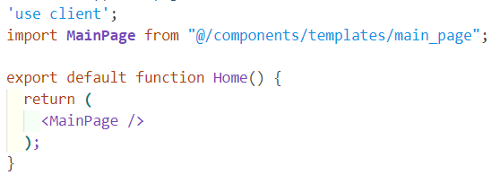

### **Langkah 6: Menggunakan dan menyediakan context dari komponen yang sama**

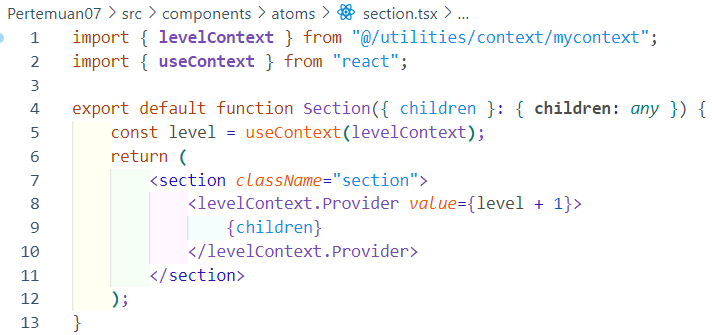

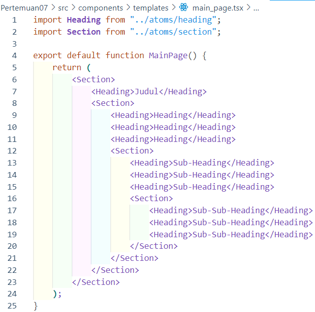

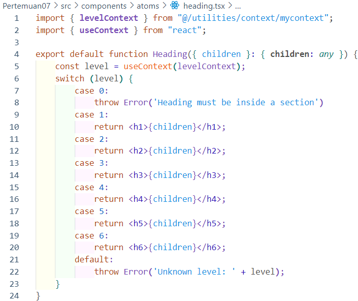

### **Soal 3**

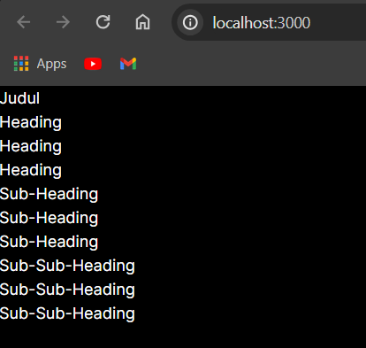
