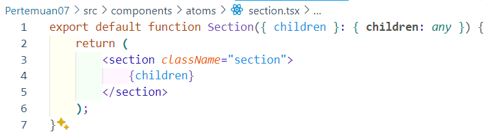

# Pertemuan 07 : Context

## **Praktikum 1: Membuat Variasi Ukuran Teks Heading dengan Context**

### **Langkah 1 : Buat project baru dan repo baru di GitHub**

### **Langkah 2: Buat struktur folder dengan prinsip atomic design**

### **Langkah 3: Buat komponen atom baru**

**Heading :**

**Section :**

**Main Page :**

### **Langkah 4: Ubah isi kode page.tsx dan run**

