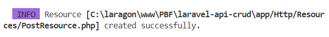
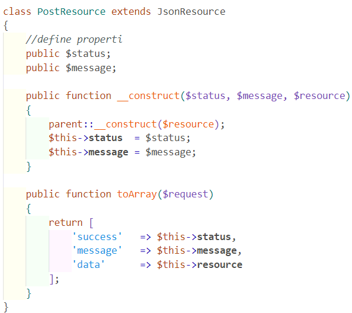
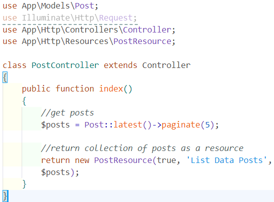
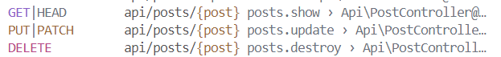
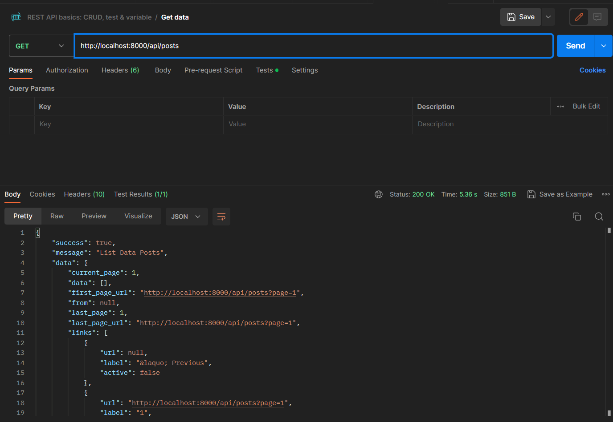
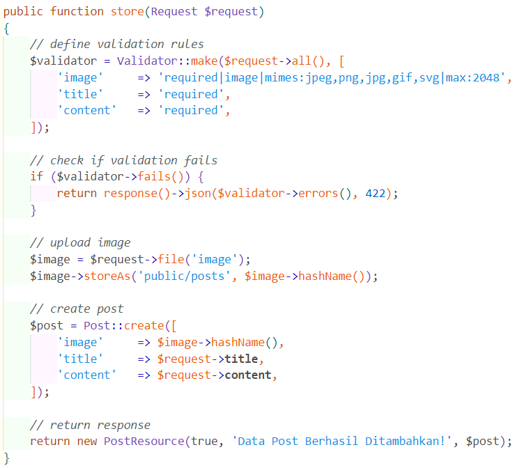
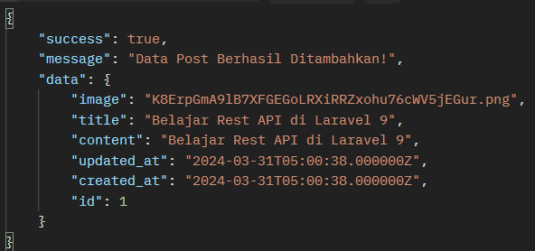

# Restful API Laravel

## **Praktikum 1 : Instalasi Laravel**

### **Langkah 1 : Membuat Proyek Laravel**

### **Langkah 2 : Menjalankan Project**

### **Langkah 3 : Konfigurasi Koneksi Database**

### **Langkah 4 : Membuat Database**

### **Langkah 5 : Membuat Model dan Migration**

### **Langkah 6 : Menjalankan Migration**

### **Langkah 7 : Menambah Mass Assigment**

### **Langkah 8 : Menjalankan Storage Link**

## **Praktikum 2 : Membuat API Resources**

### **Langkah 1 : Membuat API Resources**

### **Langkah 2 : Melakukan Custom API Resources**

## **Praktikum 3 : Menampilkan Data dari Database**

### **Langkah 1 : Membuat Controller**

### **Langkah 2 : Membuat Route API Resource**

### **Langkah 3 : Uji Coba Rest API**

## **Praktikum 4 : Insert Data ke Database**

### **Langkah 1 : Menambahkan Method**

### **Langkah 2 : Uji Coba Rest API**

