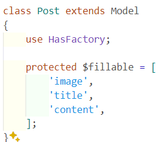

# Restful API Laravel

## **Praktikum 1 : Instalasi Laravel**

### **Langkah 1 : Membuat Proyek Laravel**

### **Langkah 2 : Menjalankan Project**

### **Langkah 3 : Konfigurasi Koneksi Database**

### **Langkah 4 : Membuat Database**

### **Langkah 5 : Membuat Model dan Migration**

### **Langkah 6 : Menjalankan Migration**

### **Langkah 7 : Menambah Mass Assigment**

### **Langkah 8 : Menjalankan Storage Link**

