# CRUD Next.Js dengan Restful API Laravel

## **Praktikum 1 : Membuat Project Baru di Next.js**

### **Langkah 1 : Installasi Node.Js**

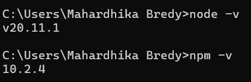

### **Langkah 2 : Membuat Project Baru di Next.Js**

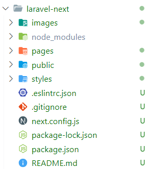

### **Langkah 3 : Menjalankan Project Next.Js**

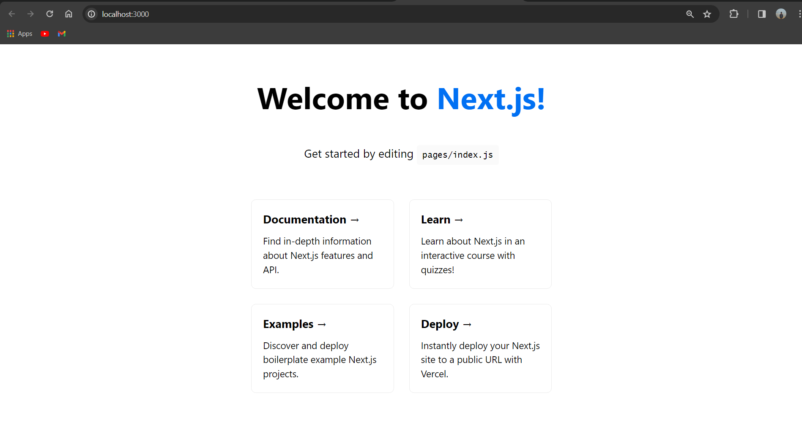

## **Praktikum 2 : Install Bootsrap dan Membuat Layout di Next.js**

### **Langkah 1 : Installasi Bootstrap**

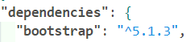

### **Langkah 2 : Konfigurasi Bootstrap di Next.Js**

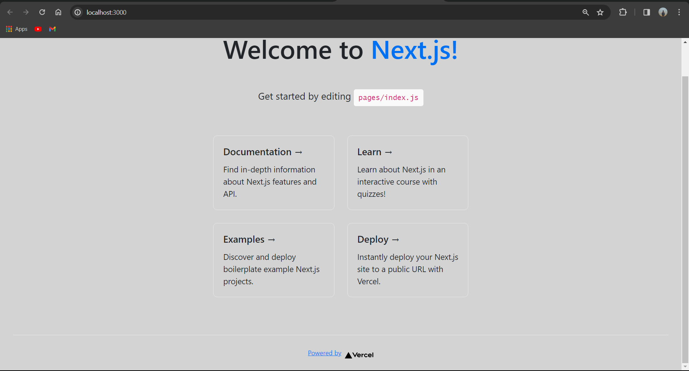

### **Langkah 3 : Membuat Component Navbar**

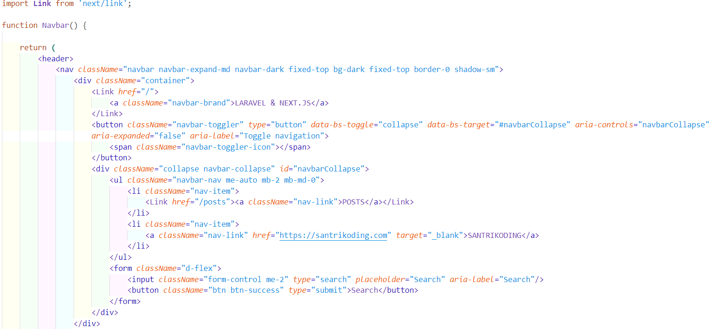

### **Langkah 4 : Membuat Layout**

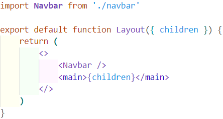

## **Praktikum 3 : Menampilkan Data di Next.js (Server Side)**

### **Langkah 1 : Install Axios**

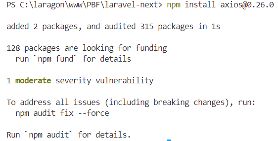

### **Langkah 2 : Konfigurasi Env untuk Endpoint**

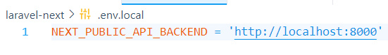

### **Langkah 3 : Menampilkan Data di Next.Js**

### **Langkah 4 : Uji Coba Menampilkan Data**

## **Praktikum 4 : Insert Data di Next.js**

### **Langkah 1 : Membuat Page Create Post**

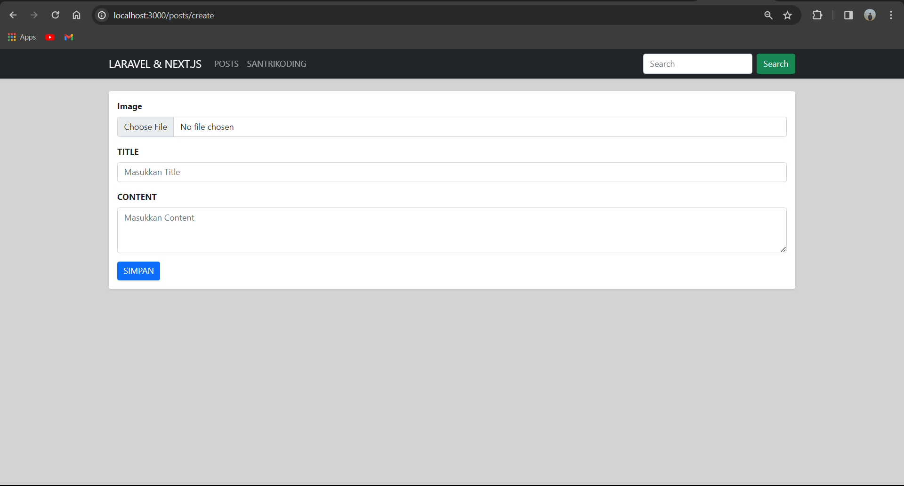

### **Langkah 2 : Uji Coba Insert Data**

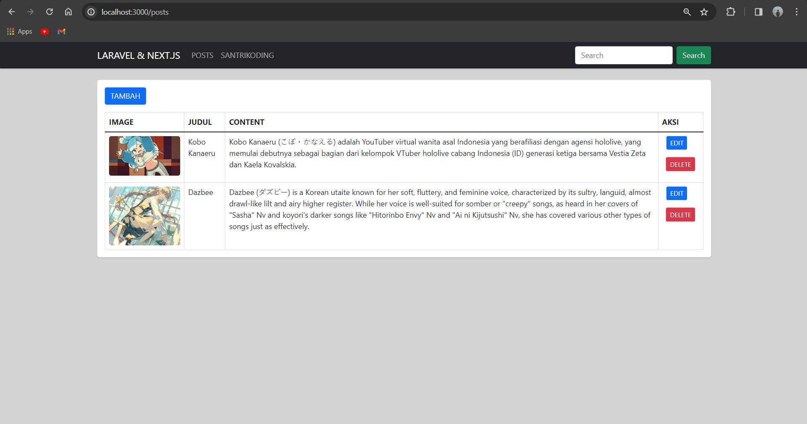

## **Praktikum 5 : Edit dan Update Data di Next.js**

### **Langkah 1 : Mengaktifkan Link Edit**

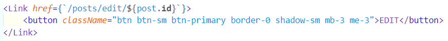

### **Langkah 2 : Membuat Page Edit Post**

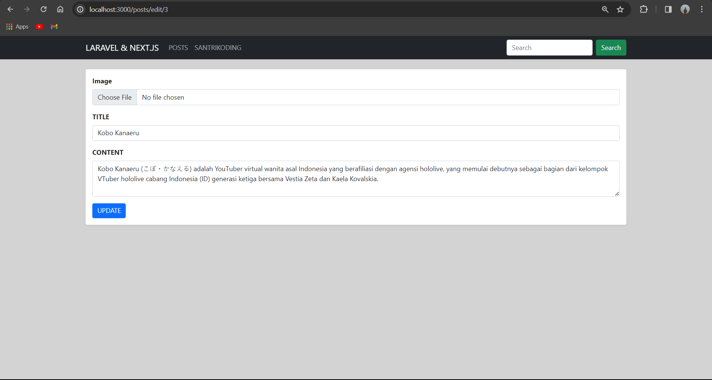

### **Langkah 3 : Uji Coba Edit dan Update Data**

Sebelum :

Sesudah :

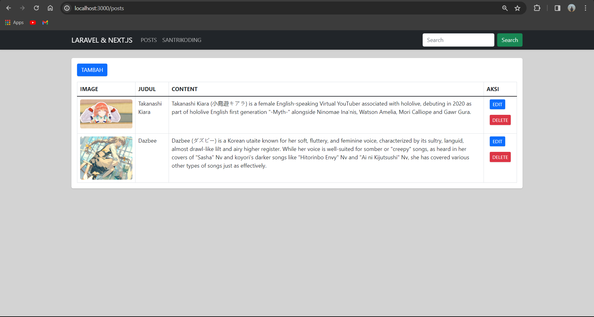

